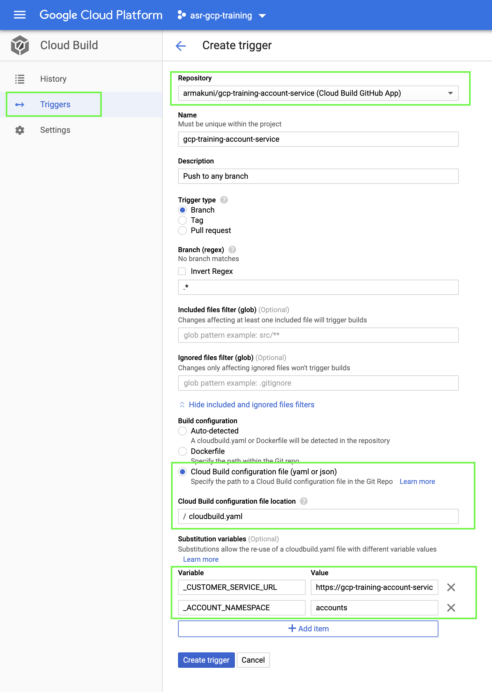

# Account Service

This Microservice is a RESTful API which can store and retrieve Account information using a Firestore database. 
The following two endpoints are available:
1. POST - http://localhost:5001/accounts/ to create an account and accept below request body with just "customerId":
 ```json
  {
    "customerId":"obrJrtC8bFSXdAmpcmKe"
  }
 ```
 Response:
  ```json
  {
    "accountNumber": 25749528,
    "accountStatus": "active",
    "customerId": "obrJrtC8bFSXdAmpcmKe"
    }

 ```
 2. GET - http://localhost:5001/accounts/{ACCOUNT_ID}  
   Response:
   ```json
   {
    "accountNumber": 25749528,
    "accountStatus": "active",
    "customerId": "obrJrtC8bFSXdAmpcmKe"
    }
 ```

Fork this repository in your github account to continue the rest of exercise.

### Requirements

- A Firestore instance up and running in your Google Cloud account
- google service account to access the Firestore

#### Refer below link for more detail about setting up the environment to use google Firestore

- https://cloud.google.com/firestore/docs/quickstart-servers

### Environment variables

The service uses below variables in its configuration. They all have default values as shown below if they are not otherwise specified:

```
ACCOUNT_NAMESPACE=accounts(default)
PORT=5001(default)
CUSTOMER_SERVICE_URL=http://localhost:5000(default)
```

To enable full functionality of the account service you must provide it with the endpoint of the customer service using the environment variable CUSTOMER_SERVICE_URL.

### To run linter
```bash
make lint
```

### To run tests
```bash
make test
```

### To run the service locally
Before starting the application locally you must set credentials json file locally to authenticate as we did for Customer Microservice.
```bash
export GOOGLE_APPLICATION_CREDENTIALS=[PATH_TO_CREDENTIALS_FILE]/[SERVICE_ACCOUNT_CREDENTIALS_FILENAME].json 
```
Note:

The ability to create new accounts will only work when the service is provided with a working customer service endpoint.
```bash
make run
```

### Deployment

#### CLI Deployment

This repository contains a cloudbuild.yaml file to deploy service on to Cloud Run.
Assuming that the ```Customer Service``` was deployed successfully and you were able to make calls manually.

To create new accounts this service requires "Customer Service URL" which can be retrieved from the Cloud Run console. As it internally validates whether that account number exists.
Note: Do not add ```'\customers\'```` or any other parameter to the URL.

Execute the below command to trigger a Cloud Build Deployment after replacing the variables with appropriate values.

```bash
gcloud builds submit --substitutions=_CUSTOMER_SERVICE_URL="[CUSTOMER_SERVICE_URL]",_ACCOUNT_NAMESPACE="[ACCOUNT_NAMESPACE]"
```

where [CUSTOMER_SERVICE_URL] is the URL of the customer service, and [ACCOUNT_NAMESPACE] is the name of the Firestore collection that stores the accounts information.
* Makes sure that variable name matches with what is been defined in the "cloudbuild.yaml". If you wish to change the variable name then you must replace all the respective references in the [cloudbuild.yaml](/cloudbuild.yaml) as well.
* Make a note of the value specified as we will need it while deploying other Microservices.
* If you do not specify the substitution parameters (to know more about substitutions [click here](https://cloud.google.com/cloud-build/docs/configuring-builds/substitute-variable-values)) the clouldbuild will use default value specified in the CloudBuild.yaml under substitution section.
* If you accidentally deploy this service before the customer, you can update its deployment retrospectively by re-running the command above with the new customer URL.

#### Setup Cloud Build Trigger to deploy Microservice on each commit

Now let us set up a Cloud Build Trigger to deploy the changes automatically with each commit.

1. Navigate to the Cloud Build page in the console and click ```Triggers```
2. Click ```Create Trigger``` and should open a new page.
3. Enter all the information highlighted in the below image.
4. Set the substitutions variables appropriately (preferably the same as the CLI step). As explained earlier if you wish you change the variable name you must change in the "cloudbuild.yaml" as well.
5. The values specified here will override any default values defined in the "cloudbuild.yaml". If you wish to change the value make a note of it.



6. Click Create Trigger and your trigger should be ready to use.
7. Make a commit and observe Cloud Build to confirm the trigger is working fine.

### API documentation

You can access the API documentation by launching the application and visiting [swagger ui](http://localhost:5001/docs/).
For accessing in Cloud Run append ```/docs/``` after the endpoint exposed by Cloud Run service.
